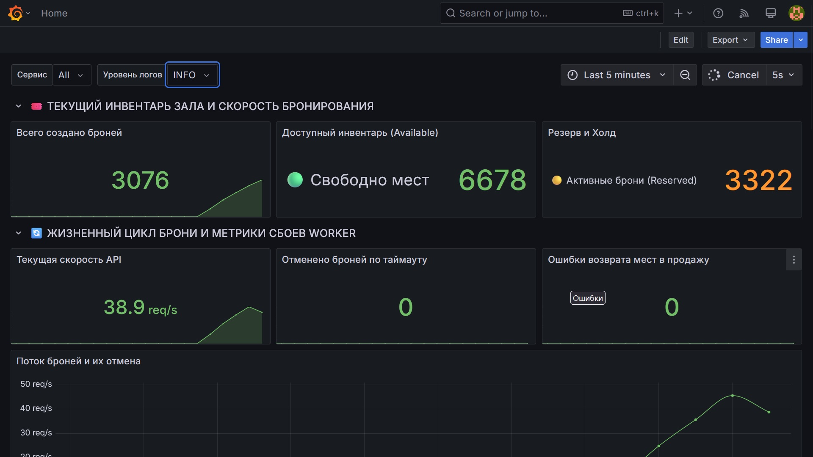
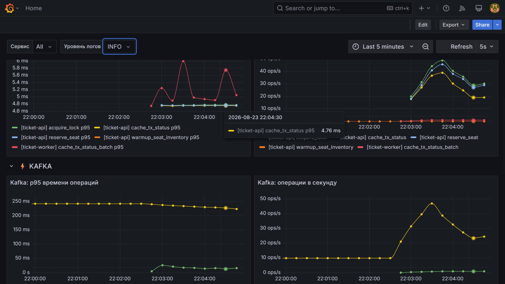

# 🎟️ Высоконагруженная система бронирования (ticket-lab)

Высоконагруженный распределенный сервис для бронирования билетов на концерты и мероприятия, разработанный на **Go** с использованием архитектуры **Clean Architecture**. 

Система спроектирована для обработки сотен тысяч одновременных запросов с полной защитой от Race Conditions, кэшированием в Redis на Lua-скриптах и асинхронным пайплайном пакетной записи через Apache Kafka в PostgreSQL. Проект поставляется со встроенным full-stack мониторингом (Prometheus, Loki, Grafana, Alloy) для полного контроля над поведением системы под нагрузкой. В текущей реализации места просто бронируются с последующей отменой по таймауту неоплаты через 10 секунд.

---

## 📊 Мониторинг и Телеметрия (Grafana Dashboards)

В систему интегрирован полноценный стек наблюдаемости (Observability). Скриншоты предустановленного дашборда Grafana во время прохождения нагрузочного тестирования:





---

## 🛠️ Инфраструктура и Быстрый старт (Docker Compose)

Вся инфраструктура, приложения и компоненты мониторинга полностью контейнеризированы и готовы к запуску одной командой.

### Требования
* Установленный **Docker** и **Docker Compose**

### Пошаговый запуск

1. **Клонируйте репозиторий:**
   ```bash
   git clone https://github.com/MBpointer/ticket-lab.git
   cd ticket-lab
   ```  

2. **Запустите весь стек в фоновом режиме:**
   ```bash
   docker-compose up -d --build
   ```
   *Команда автоматически соберет Go-сервисы (`ticket-api`, `ticket-worker`), развернет базы данных, запустит Kafka в режиме KRaft, создаст топик `orders` на 10 партиций и инициализирует дашборды в Grafana.*

3. **Убедитесь, что все контейнеры запущены:**
   ```bash
   docker-compose ps
   ```

4. **Запустите нагрузочный тест (Генератор трафика):**
   Чтобы наполнить систему данными и увидеть графики в Grafana в реальном времени, запустите скрипт эмулятора:
   ```bash
   go run cmd/emulator/main.go
   ```

5. **Остановка и полная очистка данных:**
   ```bash
   docker-compose down -v
   ```

---

## 🌐 Сетевая карта проекта и Точки доступа

После успешного старта контейнеров на вашем `localhost` открыты следующие порты:

| Сервис | Адрес / URL | Описание |
| :--- | :--- | :--- |
| **Ticket API** | `http://localhost:8080/book` | Эндпоинт для отправки POST-запросов на бронирование билетов |
| **Grafana** | `http://localhost:3000` | Панель мониторинга. **Логин:** `admin` / **Пароль:** `admin` |
| **Prometheus** | `http://localhost:9090` | Веб-интерфейс СУБД метрик и инспекция таргетов |
| **Grafana Loki** | `http://localhost:3100` | API-сервер системы сбора логов |
| **Grafana Alloy** | `http://localhost:12345` | Внутренний дашборд агента телеметрии |
| **PostgreSQL** | `localhost:5439` | Внешний порт БД (внутри сети контейнеров: `5432`) |
| **Apache Kafka** | `localhost:9092` | Порт брокера для подключения локальных утилит разработки |

---

## ✨ Ключевые Highload-оптимизации проекта

* **Защита от овербукинга:** Логика проверки остатка билетов и создания брони вынесена в **атомарные Lua-скрипты Redis**. Это полностью исключает продажу одного места разным пользователям в условиях конкурентных запросов.
* **Пакетная запись (Batch Processing):** Чтобы PostgreSQL не упирался в дисковый I/O, воркер (`ticket-worker`) собирает сообщения пачками (до 1000 штук или по таймауту в 1 секунду) и выполняет их массовую вставку за минимальное количество сетевых запросов.
* **Идемпотентность потребителей:** Защита от дублирования транзакций реализована с помощью проверки UUID заказов внутри батча и использования механизма распределенных блокировок (`SetNX`).
* **Консистентность инфраструктуры:** Для обеспечения надежности в `docker-compose.yml` настроены строгие правила `depends_on` с флагами `service_healthy`. Сервисы Go запустятся только после того, как базы данных пройдут встроенные тесты жизнеспособности (Healthchecks).
* **Безопасное выключение (Graceful Shutdown):** Обработка системных сигналов `SIGTERM` позволяет приложениям дописать текущую пачку данных и зафиксировать (commit) офсеты в Kafka перед остановкой контейнера.

---

## 🗺️ To be done (Roadmap)

Ниже представлены запланированные фичи и улучшения, которые будут реализованы в ближайшее время:

- [ ] **Реализация биллинга:** Добавление функционала оплаты и постоянного хранения данных о купленных билетах со статусом "Paid".
- [ ] **Внедрение OpenTelemetry (OTel):** Интеграция распределенной трассировки (Distributed Tracing) для сквозного трекинга запросов от HTTP API через Kafka до фонового воркера и сохранения спанов в Grafana Tempo / Jaeger.
- [ ] **Автоматизация CI/CD через GitHub Actions:** Настройка пайплайна для автоматического запуска линтеров (`golangci-lint`) и выполнения unit/integration тестов при каждом Pull Request или коммите в ветку `main`.
- [ ] **Полноценная авторизация (JWT):** Добавление middleware для валидации пользователей и разделения прав (клиент / администратор).
- [ ] **Автоматическое масштабирование воркеров:** Настройка автоскейлинга контейнеров `ticket-worker` в зависимости от размера Consumer Lag в Kafka.
- [ ] **Интеграция Grafana Alerting:** Настройка алертов в Telegram/Slack при превышении p99 Latency на API-сервере или при сбоях пакетной записи в БД.
